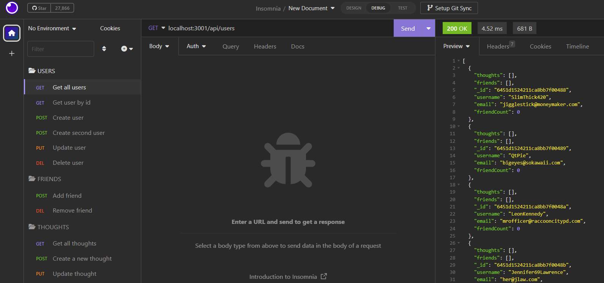
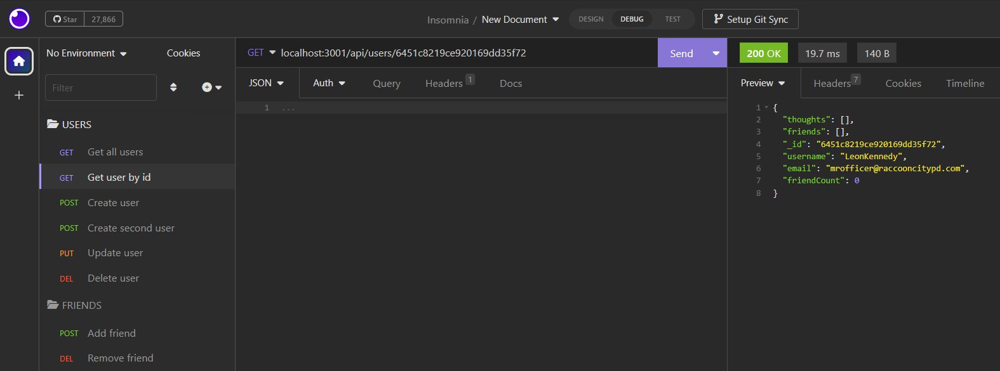
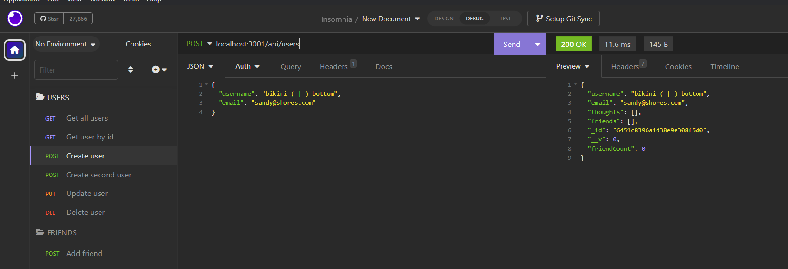
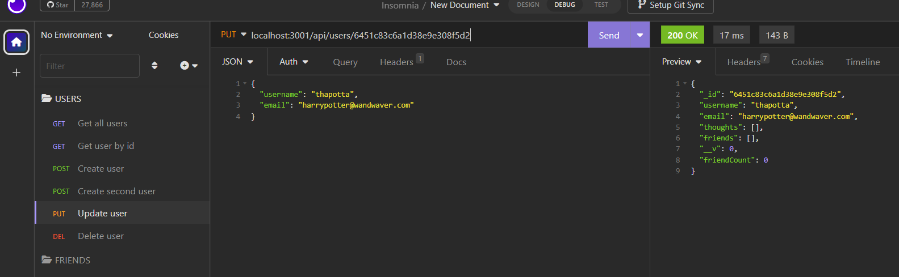
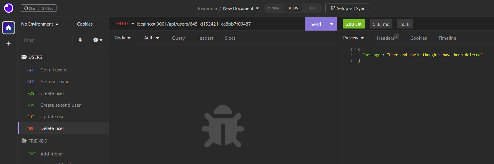
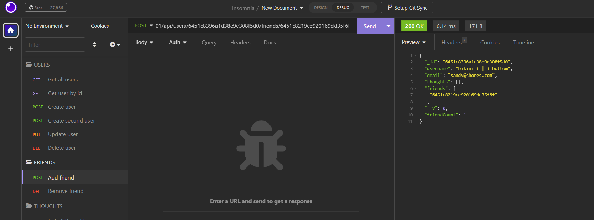
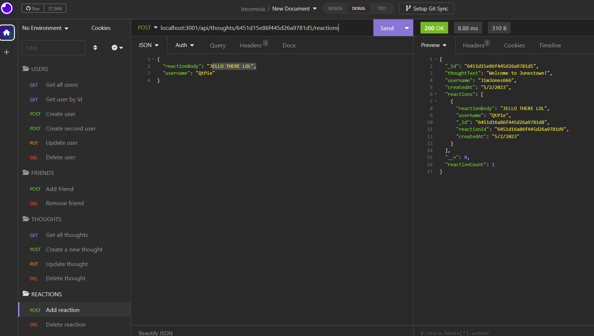

# url-friends-irl-thoughts
  [](https://opensource.org/licenses/MIT)


  This is the backend of a social media database. Users are able to sign up, post a thought, add friends, and comment reactions to other user's thoughts
  ## Table of Contents:
  * [Installation](#installation)
  * [Usage](#usage)
  * [License](#license)
  * [Contributing](#contributing)
  * [Tests](#tests)
  * [Questions](#questions)
  ## Installation:
  To install the dependencies needed, open the console and run:
  ```md
  npm i
  ```
  ## Usage:
  This is the backend of the app, so it is only able to be run/tested in Insomnia. There is seed data, so to seed the data and run the program- 
  open the terminal and type: 
  ```md
  npm run seed
  ``` 
  and then 
  ```md
  npm start
  ```
  You are able to use HTTP CRUD methods to:

  ---

  >

  GET all users or thoughts
  
  ---
  
  >

  GET user or thought by id

  ---
    
  >

  POST to create a user or thought
  
  ---
  
  >

  PUT to update a user or thought
  
  ---
  
  >

  DELETE to delete a user or thought
  
  ---
  
  >

  POST to add a friend or DELETE to delete the friendship
  
  ---
  
  >

  POST to add a reaction to a comment or DELETE to delete the reaction

  ---
  
  ## License:
  The MIT License (MIT)

      Copyright (c) undefined undefined
      
      Permission is hereby granted, free of charge, to any person obtaining a copy of this software and associated documentation files (the "Software"), to deal in the Software without restriction, including without limitation the rights to use, copy, modify, merge, publish, distribute, sublicense, and/or sell copies of the Software, and to permit persons to whom the Software is furnished to do so, subject to the following conditions:
      
      The above copyright notice and this permission notice shall be included in all copies or substantial portions of the Software.
      
      THE SOFTWARE IS PROVIDED "AS IS", WITHOUT WARRANTY OF ANY KIND, EXPRESS OR IMPLIED, INCLUDING BUT NOT LIMITED TO THE WARRANTIES OF MERCHANTABILITY, FITNESS FOR A PARTICULAR PURPOSE AND NONINFRINGEMENT. IN NO EVENT SHALL THE AUTHORS OR COPYRIGHT HOLDERS BE LIABLE FOR ANY CLAIM, DAMAGES OR OTHER LIABILITY, WHETHER IN AN ACTION OF CONTRACT, TORT OR OTHERWISE, ARISING FROM, OUT OF OR IN CONNECTION WITH THE SOFTWARE OR THE USE OR OTHER DEALINGS IN THE SOFTWARE.
  ## Contributing:
  N/A
  ## Tests:
  N/A
  ## Questions:
  If you have questions, you may contact me on [GitHub](https://github.com/d-lil) or you may reach out by contacting Daniel Liljegren at dahneel@gmail.com